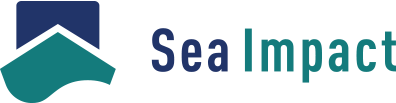

# Welcome!

This website was created using HTML, CSS, and JavaScript, hosted on GitHub.

#### Technical Skills: Python, SQL, MATLAB, Power BI, GIS, Excel, PowerPoint, Word, SharePoint

## About Me

## Education					    

| Degree | Description | 
| --- | --- |
| M.S, Sustainable Energy Engineering | Technical University of Denmark, Copenhagen (_February 2023_)	
| B.S., Mechanical Engineering | University of Applied Sciences in Saarland, Germany (_June 2019_) 

## Work Experience
**Offshore Wind Data Analyst @ [Sea Impact](https://sea-impact.com/) (_February 2023 - Present_)** 

</img>

Sea Impact is a joint venture between LAUTEC and PEAK Wind and is a market intelligence platform for offshore wind, providing key benchmarks on installation and maintenance on floating & bottom-fixed wind farms, based on AIS signals.

- Developing geospatial algorithms (GIS) to accurately detect the activities of vessels active in the offshore wind industry using AIS signals.
- Establishing, compiling and managing several data sets used as input to our analyses using complex SQL, PostGIS and Python languages.
- Visualizing results in PowerBI through DAX language and accurately presenting them for clients.
- Consulting and delivering tailored requested reports to clients (Bain & Company, BCG, Vestas, Siemens Gamesa, Vineyard Wind, Equis, Skyborn...)
- Supporting the marketing strategy of the company
- Supporting the overall business strategy of the company
- Establishing initial client contacts
- Managing the [Sea Impact Offshore Wind Map](https://sea-impact.com/offshore-wind-map/) through GIS

**Green Energy Support Engineer @ United Nations Development Programme (_July 2022 - January 2023_)**

- Managing up to 13 Solar hybrid energy projects and 6 E-Mobility projects simultaneously, all around the world, covering all key phases of a energy project implementation (site assessment, RfQ, design, procurement, installation, commissioning, O&M...)
- Designing an optimised renewable energy solution (solar + battery + low emission-grid) and deciding upon optimal location for solar panel installation
- Analysing and estimating key economic aspects such as NPV, LCoE, annual cash flows...
- Drafting business cases for renewable energy solutions (solar hybrid systems, battery, E-Mobility)
- Assisting during the installation of energy monitoring devices and renewable energy solutions in UNDP and FAO country offices worldwide.
- Optimising usage of diesel generators in UNDP and FAO country offices worldwide.
- Providing guidelines on energy efficient solutions to UNDP country offices worldwide.
- Procuring green energy solution equipment.
- Supporting daily monitoring and operation of already installed renewable solutions. Assisting the maintenance and operation of these devices.

## Projects
### Mapping my Train Routes

I am currently tracking my train routes with GIS Softwares, for commuting from Copenhagen to France or for travelling. My overall goal is to spread awareness that it is possible to travel by train all around Europe. [Access Map on MapBox](https://api.mapbox.com/styles/v1/thibaultvanheeghe/clteht9v400nr01qn3woncm3d.html?title=view&access_token=pk.eyJ1IjoidGhpYmF1bHR2YW5oZWVnaGUiLCJhIjoiY2xmcXF6M25uMDE1azNxcGJmZzJzcGozNyJ9.IMnHAvsKJxxSKsrPSWB62Q&zoomwheel=true&fresh=true#4.1/47.82/-0.41)

### NeoCamp

NeoCamp is a start-up that develops alternative equipment for festivals, designed to be environmentally friendly and long-lasting. Our business model revolves around collaborating with festival organisations that aim to minimise their environmental impact and campsite waste. We offer turnkey production, rental, and installation services for camping equipment within the campsites. Once the rental period ends, we collect the products, clean them, and make any necessary repairs.

The startup was founded in 2022 by Danilo Paciotti and myself, with the goal of providing festivals with dependable, durable, and sustainable camping equipment available for rent. Ultimately, our vision enables the reduction of waste generated by festival-goers. [Access Website](https://www.neocamps.com/)

## Publications

